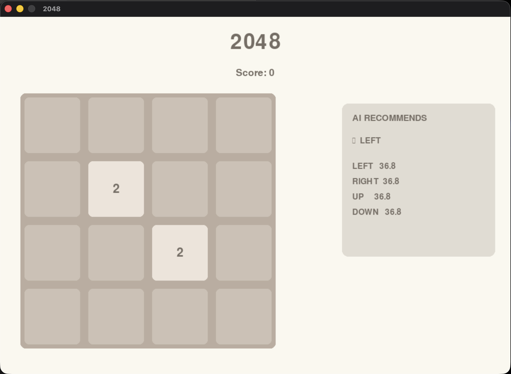

2048 AI — Expectimax-Based Decision Making
━━━━━━━━━━━━━━━━━━━━━━━━━━━━━━━━━━━━━━━━━━

An AI-powered 2048 game that uses stochastic
Expectimax search and heuristic evaluation to
select moves under uncertainty.

## Gameplay

Features
━━━━━━━━

✓ Playable 2048 implementation. 
✓ AI move recommendation. 
✓ Expectimax search. 
✓ Stochastic tile modeling. 
✓ Heuristic board evaluation. 
✓ Search-depth benchmarking. 
✓ Statistical analysis. 
✓ Performance visualization. 

Architecture
━━━━━━━━━━━━

Game → Simulator → Expectimax → Evaluation → Best Move

Mathematical Model
━━━━━━━━━━━━━━━━━

H(s) = w₁E(s) + w₂M(s) + w₃S(s) + w₄T(s) + w₅C(s)

Experiments
━━━━━━━━━━

[GRAPH]

Search depth vs performance

[GRAPH]

Search depth vs computation time

Results
━━━━━━━━

Depth 3 currently provides the best observed
performance in the benchmark configuration,
while deeper search introduces substantially
higher computational cost.

Future Work
━━━━━━━━━━

→ Heuristic weight optimization
→ Monte Carlo Tree Search
→ Reinforcement Learning
→ Adaptive search depth

## Research Highlights

This project investigates the trade-off between
decision quality and computational cost in a
stochastic game environment.

The AI uses Expectimax search with a heuristic
evaluation function incorporating:

- Empty-cell availability
- Board monotonicity
- Tile smoothness
- Maximum tile value
- Corner positioning

Experiments evaluate the effect of search depth
on:

- Average score
- Maximum tile
- Win rate
- Number of moves
- AI decision time

## Why I Built This

2048 provides a compact environment for studying
decision-making under uncertainty.

Unlike deterministic board games, every move can
introduce stochasticity through the random placement
of new tiles.

This makes the game useful for exploring:

- Adversarial and stochastic search
- Heuristic optimization
- Decision-making under uncertainty
- Computational trade-offs
- Experimental AI evaluation

## Roadmap

### Completed

- [x] 2048 game engine
- [x] Animated tile movement
- [x] Expectimax AI
- [x] Heuristic board evaluation
- [x] AI move recommendation
- [x] Search-depth benchmarking
- [x] Statistical analysis
- [x] Performance visualization

### In Progress

- [ ] Heuristic weight optimization
- [ ] Automated AI training
- [ ] Larger benchmark dataset

### Future Work

- [ ] Monte Carlo Tree Search
- [ ] Reinforcement Learning agent
- [ ] Neural network evaluation function
- [ ] Adaptive search depth
- [ ] AI-vs-AI comparison
